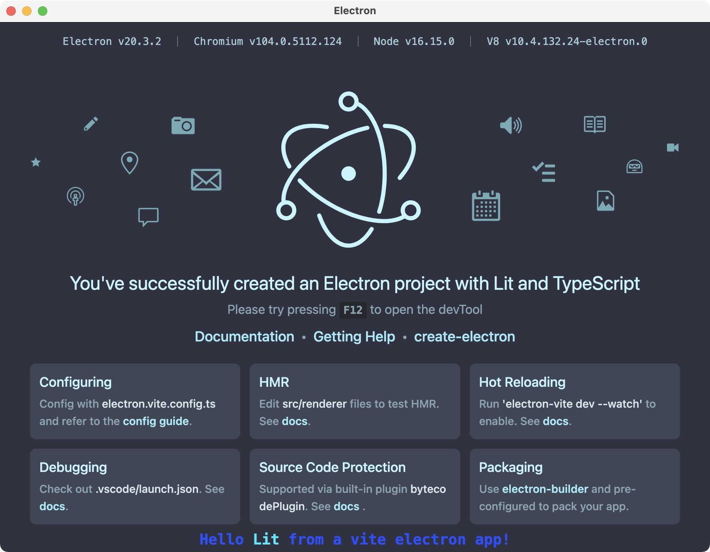

# An Electron application built with electron-vite, Lit and Typescript


This project started as a clone of [electron-vite-boilerplate](https://github.com/alex8088/electron-vite-boilerplate/tree/master/src/renderer/src) by [alex8088](https://github.com/alex8088).

It was modified by [rudifa](https://github.com/rudifa), replacing the Vue dependencies and Vue components by Lit dependencies and Lit components.

You can use this modified project as a template for building your own Electron applications using the [Lit](https://lit.dev/docs/) components.

It was tested only on a Mac, with `npm run dev` and `npm run build:mac`.

If you find any issues with this project, please report them.

If you build and run the project on the Windows or the Linux platform, please report the success (or failure).



## Features

- **📁 Scaffolding - [create-electron](https://github.com/alex8088/quick-start/tree/master/packages/create-electron)**, scaffolding your project quickly
  - Currently supported framework: `Vue`, `React`, `Svelte`, `Solid`
- **🚀 Build - [electron-vite](https://github.com/alex8088/electron-vite)**, fast and easy-to-use build tool integrated with Vite 3
  - [Fast HMR](https://evite.netlify.app/guide/hmr-in-renderer.html)
  - [Hot Reloading](https://evite.netlify.app/guide/hot-reloading.html)
  - [Easy to Debug](https://evite.netlify.app/guide/debugging.html)
  - [Source code protection](https://evite.netlify.app/guide/source-code-protection.html) (compile to V8 bytecode to protect source code)
- **💡 Development - [electron-toolkit](https://github.com/alex8088/electron-toolkit)**, useful API, help you develop
- **📦 Pack - [electron-builder](https://www.electron.build)**, pre-configured to pack your app


## Recommended IDE Setup

- [VSCode](https://code.visualstudio.com/) + [ESLint](https://marketplace.visualstudio.com/items?itemName=dbaeumer.vscode-eslint) + [Prettier](https://marketplace.visualstudio.com/items?itemName=esbenp.prettier-vscode) + [lit-plugin](https://marketplace.visualstudio.com/items?itemName=runem.lit-plugin)

## Project Setup

### Install

```bash
$ npm install
```

### Development

```bash
$ npm run dev
```

### Build

```bash
# For windows
$ npm run build:win

# For macOS
$ npm run build:mac

# For Linux
$ npm run build:linux
```
